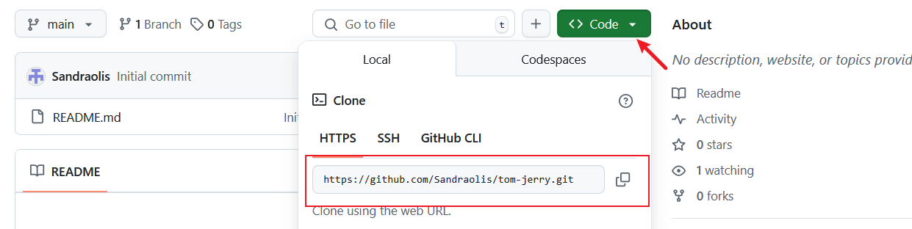
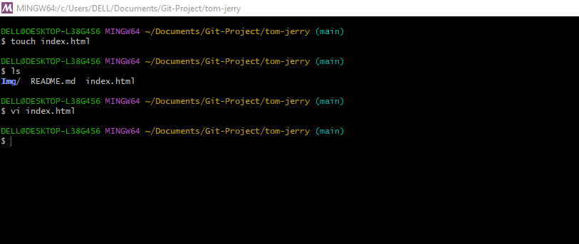

# PART 1: Github Setup and Configuration
This guide will help you through the basics of using GitHub, including installing Git, creating a repository, cloning it, and pushing those changes back to GitHub.

## Install Git:
1. **Download Git**:
- Visit the official website to download
- Click [here](https://git-scm.com/.)
- Download the appropriate version for your operating system (Windows, macOS, or Linux).

2. **Install Git**:
- Follow the installation instructions for your OS `operating system`
- Once installed, open a terminal or command prompt and verify the installation by running this command: 

`git --version`
- This should display the installed version of Git

## Login to Github
1. **Create a GitHub Account**:
- Click [here](https://github.com/.) to sign up

2. ## Login to Github:
- Click [here](https://github.com/login) to login using your login details.

# Create Github Repository:
1. ### **Create a new Repository**:
- On GitHub, click the "+" icon or the "New" word in the top-right corner and select "New repository".
- Name the repository `tom-jerry`
- Optionally, add a description.
- Choose "Public" or "Private" visibility.
- Check the box to "Initialize this repository with a README".
- Click "Create repository".

Create Repository

# Clone The Repository:
1. ### Copy the repository URL:

- On the repository page, click on the `Code` button.
- Copy the HTTP URL (eg., https://github.com/your-username/tom-jerry.git). 

2. ### Clone the Repository locally.
- Open your terminal or command prompt.
- Create a folder named *Git_project*, using the below command.

`mkdir Git-Project`

- Navigate into the `Git-Project` folder by running the below command.

`cd Git-Project`

- Clone the repository by using the copied URL:

`git clone https://github.com/your-username/tom-jerry.git`

- Navigate into the cloned repository:

`cd tom-jerry`

# Make Change and Commit.
1. Create a new file:
- Create an empty `index.html` file by using the below command.

`touch index.html`
- Add some content to the file using a text editor or IDE.

2. ### Check Git status
- Run the following command to see the changes that have not been staged: 

`git status`

- its showing in red and statimg that it has not be staged, so to stage and track it, we use the command `git add .` and `git status` again to know if it has been staged and tracked.

- The above picture shows that it has been staged and tracked after using the `git add .` command.

3. ### Commit Changes:
 - Commit the changes with a message.
 git commit -m "this is my first commit"

 

 # Push Change To Github
 1. ### push to Github

 - Push the changes to the *main* branch on GitHub:
 - Using this command
 `git push origin main`

  

  2. ### Verify on Github
  - Go to your repository on GitHub and verify that the index.html file has been added.

  

  # PART 2: Simulating Tom and Jerry's Team Work.
This guide will walk you through the basics of using GitHub, including navigating a project directory, creating branches, making changes, pulling lastest changes from the central repository, and collaborating with others. We'll simulate workflows for two contributors, Tom and Jerry.

